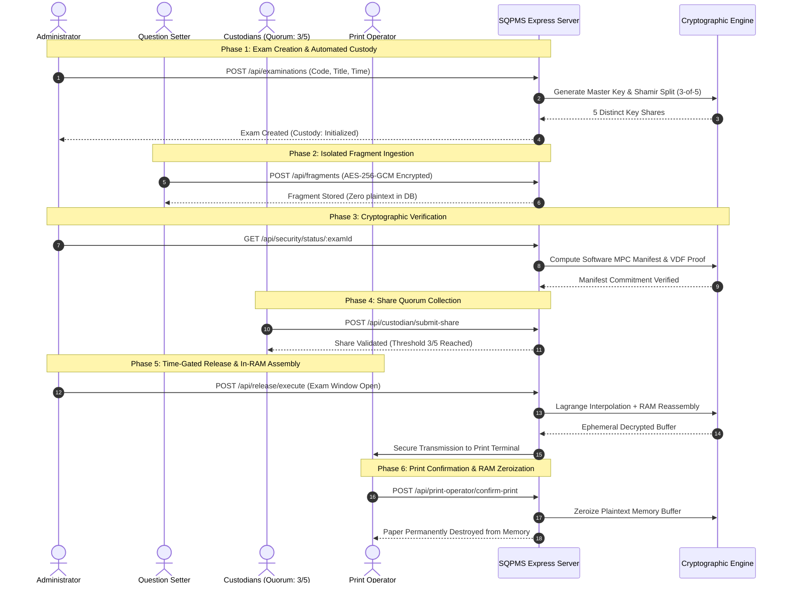

<div align="center">

# 🛡️ Secure Question Paper Management System (SQPMS)

**A Zero-Trust, Multi-Actor Cryptographic Protocol for Leak-Proof Examination Management**

[](https://secure-question-paper.vercel.app)
[](https://nodejs.org/)
[](https://expressjs.com/)
[](https://firebase.google.com/)
[](https://en.wikipedia.org/wiki/Shamir%27s_secret_sharing)
[](#-strict-separation-of-duties-two-way-role-confinement)
[](LICENSE)

<p align="center">
  <em>Engineered so that a complete, readable question paper <strong>never exists anywhere</strong> in storage, disk, or memory before the exact scheduled examination second.</em>
</p>

</div>

---

## 📑 Table of Contents

- [Overview & The Problem](#-overview--the-problem)
- [Core Cryptographic Architecture](#-core-cryptographic-architecture)
- [System Architecture & Flow](#-system-architecture--flow)
- [Strict Separation of Duties (Two-Way Role Confinement)](#-strict-separation-of-duties-two-way-role-confinement)
- [Threat Model & Security Guarantees](#-threat-model--security-guarantees)
- [Evaluation Credentials](#-evaluation-credentials)
- [End-to-End Operational Lifecycle](#-end-to-end-operational-lifecycle)
- [REST API Reference](#-rest-api-reference)
- [Project Directory Structure](#-project-directory-structure)
- [Installation & Getting Started](#-installation--getting-started)
- [License](#-license)

---

## 🔍 Overview & The Problem

High-stakes university, civil service, and competitive examination systems routinely suffer catastrophic leaks. Traditional platforms secure papers using access control lists, firewalls, and database encryption at rest. However, **traditional systems share a critical vulnerability:**

> **The Single-Point-of-Failure Vulnerability:**  
> A complete plaintext or decryptable draft of the paper exists on a server, admin workstation, or storage volume hours or days prior to the examination. A single compromised database credential, rogue administrator, or insider exfiltration ruins the integrity of the entire examination.

### The SQPMS Paradigm Shift

SQPMS replaces human and administrative trust with **pure mathematical and cryptographic guarantees**:

1. **No Single Entity Holds the Paper:** Question setters only author isolated, encrypted question fragments. No setter or administrator ever compiles, reviews, or sees the full paper prior to release.
2. **Cryptographic Key Splitting (Shamir 3-of-5):** The master decryption keys are partitioned into 5 shares using Galois Field $\text{GF}(2^8)$ polynomials. A minimum quorum of 3 independent custodians must physically submit their shares.
3. **Sequential Time-Lock (Wesolowski VDF):** Decryption is bound to a Verifiable Delay Function. Even if an attacker steals all shares ahead of time, non-parallelizable sequential squaring prevents decryption before the scheduled time-lock window expires.
4. **RAM-Only Ephemeral Reassembly:** When release criteria are met, the paper is reconstituted strictly within volatile memory, transmitted directly to the authorized print operator, and wiped immediately upon print confirmation.

---

## 🔐 Core Cryptographic Architecture

```
                                  [ Question Setters ]
                                           │
                                 AES-256-GCM Encryption
                                           ▼
                                ┌─────────────────────┐
                                │ Encrypted Fragments │
                                │    (Cloud DB)       │
                                └──────────┬──────────┘
                                           │
                    ┌──────────────────────┼──────────────────────┐
                    ▼                      ▼                      ▼
         ┌────────────────────┐ ┌────────────────────┐ ┌────────────────────┐
         │ Shamir's Secret    │ │ Software MPC       │ │ Wesolowski VDF     │
         │ Sharing (3-of-5)   │ │ Manifest Hash      │ │ Time-Lock Gate     │
         │ GF(2^8) Custody    │ │ Additive Sharing   │ │ Sequential SHA-256 │
         └─────────┬──────────┘ └─────────┬──────────┘ └─────────┬──────────┘
                   │                      │                      │
                   └──────────────────────┼──────────────────────┘
                                          │  (Exact Exam Release Window)
                                          ▼
                               ┌─────────────────────┐
                               │  Ephemeral In-RAM   │
                               │  Reassembly Engine  │
                               └──────────┬──────────┘
                                          │ Direct Socket Handoff
                                          ▼
                               ┌─────────────────────┐
                               │ Print Workstation   │ ──► Memory Zeroized
                               └─────────────────────┘
```

### 1. Shamir's Secret Sharing over $\text{GF}(2^8)$
- Implementation: `backend/security/shamir.js`
- Operates over the irreducible Rijndael Galois field polynomial:
  $$P(x) = x^8 + x^4 + x^3 + x + 1 \pmod 2 \quad (0\text{x}11\text{b})$$
- Splits 256-bit AES master keys into 5 distinct cryptographic shares $(x_i, y_i)$.
- Any 3 shares can reconstruct the polynomial using Lagrange interpolation:
  $$L(x) = \sum_{j=1}^{k} y_j \prod_{m \neq j} \frac{x - x_m}{x_j - x_m} \pmod{256}$$
- Fewer than 3 shares yield zero mathematical information regarding the master key.

### 2. Wesolowski-Style Verifiable Delay Function (VDF)
- Implementation: `backend/security/vdf.js`
- Enforces an inherently non-parallelizable, sequential SHA-256 computational workload over $T = 120,000+$ iterations:
  $$y = H^{(T)}(x) = \underbrace{H(H(\dots H(x)\dots))}_{T \text{ iterations}}$$
- Prevents parallel ASIC or GPU clusters from short-circuiting the time-lock delay.
- Enables $O(1)$ fast verification by the system while mandating sequential wall-clock compute.

### 3. Additive Multi-Party Computation (MPC) Manifests
- Implementation: `backend/security/mpc.js`
- Generates an immutable release commitment across encrypted fragments and custody fingerprints without revealing individual inputs.
- Any unauthorized fragment substitution or alteration invalidates the composite MPC checksum and immediately halts release.

### 4. Canary & Decoy Honeypot Traps
- Implementation: `backend/security/canary.js`
- Injects synthetic decoy fragments and canary tokens into the datastore.
- Unauthorized querying, scraping, or probing triggers an instant security alert, revokes actor credentials, and logs the incident to an immutable audit ledger.

---

## 👥 Strict Separation of Duties (Two-Way Role Confinement)

The system implements strict Zero-Trust Role-Based Access Control (RBAC). Both client-side route guards and server-side JWT verification enforce that **actors are physically restricted only to their authorized domain**:

```
             ┌─────────────────────────────────────────────────────────┐
             │                     LOGIN ROUTER                        │
             └────────────────────────────┬────────────────────────────┘
                                          │
            ┌───────────────────┬─────────┴─────────┬───────────────────┐
            ▼                   ▼                   ▼                   ▼
     ┌──────────────┐    ┌──────────────┐    ┌──────────────┐    ┌──────────────┐
     │ADMINISTRATOR │    │QUESTION SETTER│   │KEY CUSTODIAN │   │PRINT OPERATOR│
     │/overview.html│    │/setter.html  │    │/custodian-   │    │/print-       │
     │              │    │              │    │portal.html   │    │operator.html │
     └──────┬───────┘    └──────┬───────┘    └──────┬───────┘    └──────┬───────┘
            │                   │                   │                   │
   ┌────────┴─────────┐┌────────┴─────────┐┌────────┴─────────┐┌────────┴─────────┐
   │• Schedule Exams  ││• Upload assigned ││• Hold 1 Shamir   ││• Ephemeral 1-time│
   │• Assign Personnel││  encrypted       ││  key share       ││  decrypted view  │
   │• Monitor VDF/MPC ││  fragments       ││• Submit share    ││• Confirm physical│
   │• Trigger Release ││• No admin access ││  at exam time    ││  print & zero RAM│
   │❌ CANNOT view    ││❌ CANNOT view    ││❌ CANNOT view    ││❌ CANNOT view    │
   │   fragments or   ││   other setters  ││   fragments or   ││   paper before   │
   │   hold shares    ││   or full paper  ││   admin portal   ││   release time   │
   └──────────────────┘└──────────────────┘└──────────────────┘└──────────────────┘
```

| Role | Landing Portal | Primary Responsibilities | Strict Security Boundaries |
| :--- | :--- | :--- | :--- |
| **Administrator** | `/overview.html` | Schedules exams, provisions staff, monitors MPC/VDF telemetry, authorizes gate. | **Cannot view question plaintext; cannot submit custody shares.** |
| **Question Setter** | `/setter.html` | Authors and uploads AES-256-GCM encrypted fragments for assigned exams. | **Cannot view other setters' fragments, custody keys, or admin consoles.** |
| **Custodian (1–5)** | `/custodian-portal.html` | Holds one isolated Shamir share; submits it during the release window. | **Cannot view question fragments; cannot view other custodians' shares.** |
| **Print Operator** | `/print-operator.html` | Receives ephemeral decrypted package at scheduled time; executes secure printing. | **Cannot access paper prior to release; memory wiped immediately on confirmation.** |

---

## 🛡️ Threat Model & Security Guarantees

| Potential Threat / Attack Vector | Attack Method | SQPMS Cryptographic Defense |
| :--- | :--- | :--- |
| **Rogue Administrator** | Admin tries to view questions before exam. | **Zero-Knowledge Architecture:** Admin console has no fragment viewing capability or key shares. |
| **Database Compromise** | Attacker dumps entire Firestore database. | **AES-256-GCM + Shamir:** Only encrypted ciphertext exists. Master keys are split across custodians. |
| **Colluding Custodians (< 3)** | 2 custodians attempt to reconstruct the key. | **Information-Theoretic Security:** $\text{GF}(2^8)$ Shamir threshold mathematically reveals zero bits for $< 3$ shares. |
| **Pre-Release Computation** | Attacker obtains 3 shares ahead of schedule. | **Wesolowski VDF Time-Lock:** Inherent sequential squaring delays computation until the exam window. |
| **Data Tampering** | Malicious injection of fake questions. | **MPC Manifest Commitment:** Any bit-level modification breaks the MPC hash validation and blocks release. |
| **Post-Print Exfiltration** | Attacker scrapes workstation memory or disk. | **Zero-Disk Reassembly:** Document reassembled in volatile RAM only; wiped immediately upon print confirmation. |
| **Unauthorized DB Crawling** | Script probes collections for sensitive records. | **Canary Traps:** Dynamic honeypot questions detect probes, trigger alarms, and invalidate sessions. |

---

## 🔑 Evaluation Credentials

The database is seeded with 4 pre-configured accounts for testing each role:

| Role | Name | Email | Password | Assigned Workspace |
| :--- | :--- | :--- | :--- | :--- |
| **Administrator** | System Administrator | `admin@test.com` | `Admin@12345` | `/overview.html` |
| **Question Setter** | Srii | `setter@test.com` | `Setter@12345` | `/setter.html` |
| **Custodian** | Krithick | `custody@test.com` | `Custody@12345` | `/custodian-portal.html` |
| **Print Operator** | Reshmi | `print@test.com` | `Print@12345` | `/print-operator.html` |

---

## 🔄 End-to-End Operational Lifecycle



---

## 📡 REST API Reference

### Authentication & Sessions
| Method | Endpoint | Access | Description |
| :--- | :--- | :--- | :--- |
| `GET` | `/api/health` | Public | System status, uptime, and engine diagnostics. |
| `POST` | `/api/register` | Public / Admin | Register user (admin registration requires existing admin token). |
| `GET` | `/api/me` | Authenticated | Return authenticated caller profile and RBAC role. |

### Examination & Question Management
| Method | Endpoint | Access | Description |
| :--- | :--- | :--- | :--- |
| `GET` | `/api/examinations` | Admin | List all registered examinations and status. |
| `POST` | `/api/examinations` | Admin | Create exam & auto-initialize Shamir 3-of-5 custody. |
| `GET` | `/api/fragments` | Setter / Admin | Retrieve encrypted fragments for an exam. |
| `POST` | `/api/fragments` | Setter | Upload AES-256-GCM encrypted question fragment. |

### Cryptographic Security & Custody
| Method | Endpoint | Access | Description |
| :--- | :--- | :--- | :--- |
| `POST` | `/api/security/initialize` | Admin | Re-initialize Shamir key shares & MPC manifest. |
| `GET` | `/api/security/status/:examId` | Admin | Fetch custody threshold, MPC manifest, and canary status. |
| `GET` | `/api/custodian/my-assignment` | Custodian | Retrieve caller's assigned exam and share index. |
| `POST` | `/api/custodian/submit-share` | Custodian | Submit 1 of 5 Shamir shares toward quorum. |

### Release & Secure Printing
| Method | Endpoint | Access | Description |
| :--- | :--- | :--- | :--- |
| `GET` | `/api/release/status/:examId` | Admin | Check VDF countdown, threshold status, and release gate. |
| `POST` | `/api/release/execute` | Admin | Execute time-gated controlled release to memory. |
| `GET` | `/api/print-operator/my-assignment` | Print Operator | Fetch decrypted package during active release window. |
| `POST` | `/api/print-operator/confirm-print` | Print Operator | Confirm physical print execution and trigger memory wipe. |
| `GET` | `/api/audit-logs` | Admin | Inspect immutable SHA-256 chained audit events. |

---

## 📁 Project Directory Structure

```text
secure-question-paper/
├── backend/
│   ├── config/
│   │   └── firebase-admin.js       # Firebase Admin SDK initialization & credential loading
│   ├── middleware/
│   │   ├── auth.js                 # Session token verification with in-memory TTL caching
│   │   └── role.js                 # Strict server-side RBAC route guards
│   └── security/
│       ├── canary.js               # Decoy fragment honeypot & intrusion detection
│       ├── mpc.js                  # Additive Secret Sharing MPC manifest computation
│       ├── release-agent.js        # Ephemeral in-memory paper reassembly & zeroization
│       ├── shamir.js               # GF(2^8) Galois Field Shamir Secret Sharing (3-of-5)
│       └── vdf.js                  # Wesolowski-style sequential SHA-256 delay proof
├── public/
│   ├── css/
│   │   ├── design.css              # Universal design system (Dark-Gold visual hierarchy)
│   │   └── login.css               # Dedicated authentication layout styles
│   ├── js/
│   │   ├── auth.js                 # Client-side session management & role confinement guards
│   │   ├── login.js                # Instant authentication handler & portal router
│   │   ├── register.js             # User registration controller
│   │   ├── overview.js             # Administrator operations dashboard
│   │   ├── exams.js                # Examination scheduler & auto-custody triggering
│   │   ├── security.js             # MPC manifest verification & custody telemetry
│   │   ├── release.js              # Time-gated release console & countdowns
│   │   ├── audit.js                # Immutable audit ledger inspector
│   │   ├── users.js                # User directory & examination role assignment
│   │   ├── setter.js               # Setter fragment authoring & AES encryption
│   │   ├── setter-shell.js         # Dedicated setter workspace shell
│   │   ├── custodian-portal.js     # Custodian share review & submission
│   │   ├── custodian-shell.js      # Dedicated custodian workspace shell
│   │   ├── print-operator.js       # Print operator workstation & wipe trigger
│   │   ├── print-shell.js          # Dedicated print operator terminal shell
│   │   ├── shell.js                # Administrator navigation shell
│   │   └── spotlight.js            # Hardware-accelerated dynamic cursor lighting
│   ├── login.html                  # Universal authentication portal
│   ├── register.html               # User registration portal
│   ├── overview.html               # Administrator dashboard
│   ├── exams.html                  # Examination management
│   ├── security.html               # Cryptographic security console
│   ├── release.html                # Controlled release console
│   ├── audit.html                  # Audit logs & compliance review
│   ├── users.html                  # User directory & exam role assignments
│   ├── setter.html                 # Question setter portal
│   ├── custodian-portal.html       # Custodian share submission portal
│   └── print-operator.html         # Print operator workstation portal
├── server.js                       # Main Express application & API routing
├── package.json                    # Dependencies & engine requirements
└── README.md                       # Complete technical documentation
```

---

## ⚙️ Installation & Getting Started

### Prerequisites
- **Node.js**: `v20.0.0` or higher
- **npm**: `v9.0.0` or higher
- **Firebase Project**: Cloud Firestore and Firebase Authentication enabled

### 1. Clone Repository
```bash
git clone https://github.com/Krithick-Rajan/Secure-Question-Paper.git
cd Secure-Question-Paper
npm install
```

### 2. Configure Environment
Create a `.env` file in the root directory:
```env
PORT=5000
FRAGMENT_ENCRYPTION_KEY=8f4c2a91d7e63b508c1a9e42f6b73015d9c4e8a2176f0b3d5a9c8e1f6247b093
VDF_ITERATIONS=120000
```

### 3. Provide Firebase Admin Credentials
Place your service account JSON file in the project root:
```text
firebase-service-account.json
```
*(This file is ignored by `.gitignore` to prevent credential exposure).*

### 4. Run Server
```bash
# Start production server
npm start

# Or run with auto-reload during development
npm run dev
```

Navigate to: `http://localhost:5000`

---

## 📜 License

This project is licensed under the [ISC License](LICENSE).

<div align="center">
  <sub>Developed by Krithick Rajan · Zero-Trust Examination Cryptography</sub>
</div>